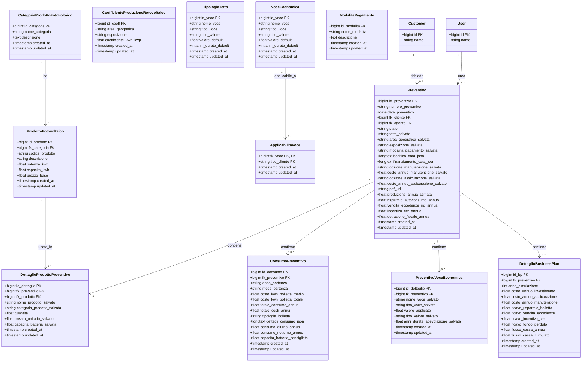

```mermaid
classDiagram
    class CategoriaProdottoFotovoltaico {
        +bigint id_categoria PK
        +string nome_categoria
        +text descrizione
        +timestamp created_at
        +timestamp updated_at
    }

    class ProdottoFotovoltaico {
        +bigint id_prodotto PK
        +bigint fk_categoria FK
        +string codice_prodotto
        +string descrizione
        +float potenza_kwp
        +float capacita_kwh
        +float prezzo_base
        +timestamp created_at
        +timestamp updated_at
    }

    class CoefficienteProduzioneRotovoltaico {
        +bigint id_coeff PK
        +string area_geografica
        +string esposizione
        +float coefficiente_kwh_kwp
        +timestamp created_at
        +timestamp updated_at
    }

    class TipologiaTetto {
        +bigint id_voce PK
        +string nome_voce
        +string tipo_voce
        +string tipo_valore
        +float valore_default
        +int anni_durata_default
        +timestamp created_at
        +timestamp updated_at
    }

    class VoceEconomica {
        +bigint id_voce PK
        +string nome_voce
        +string tipo_voce
        +string tipo_valore
        +float valore_default
        +int anni_durata_default
        +timestamp created_at
        +timestamp updated_at
    }

    class ApplicabilitaVoce {
        +bigint fk_voce PK, FK
        +string tipo_cliente PK
        +timestamp created_at
        +timestamp updated_at
    }

    class ModalitaPagamento {
        +bigint id_modalita PK
        +string nome_modalita
        +text descrizione
        +timestamp created_at
        +timestamp updated_at
    }

    class Preventivo {
        +bigint id_preventivo PK
        +string numero_preventivo
        +date data_preventivo
        +bigint fk_cliente FK
        +bigint fk_agente FK
        +string stato
        +string tetto_salvato
        +string area_geografica_salvata
        +string esposizione_salvata
        +string modalita_pagamento_salvata
        +longtext bonifico_data_json
        +longtext finanziamento_data_json
        +string opzione_manutenzione_salvata
        +float costo_annuo_manutenzione_salvato
        +string opzione_assicurazione_salvata
        +float costo_annuo_assicurazione_salvato
        +string pdf_url
        +float produzione_annua_stimata
        +float risparmio_autoconsumo_annuo
        +float vendita_eccedenze_rid_annua
        +float incentivo_cer_annuo
        +float detrazione_fiscale_annua
        +timestamp created_at
        +timestamp updated_at
    }

    class ConsumoPreventivo {
        +bigint id_consumo PK
        +bigint fk_preventivo FK
        +string anno_partenza
        +string mese_partenza
        +float costo_kwh_bolletta_medio
        +float costo_kwh_bolletta_totale
        +float totale_consumo_annuo
        +float totale_costi_annui
        +string tipologia_bolletta
        +longtext dettagli_consumo_json
        +float consumo_diurno_annuo
        +float consumo_notturno_annuo
        +float capacita_batteria_consigliata
        +timestamp created_at
        +timestamp updated_at
    }

    class DettaglioProdottoPreventivo {
        +bigint id_dettaglio PK
        +bigint fk_preventivo FK
        +bigint fk_prodotto FK
        +string nome_prodotto_salvato
        +string categoria_prodotto_salvata
        +float quantita
        +float prezzo_unitario_salvato
        +float capacita_batteria_salvata
        +timestamp created_at
        +timestamp updated_at
    }

    class PreventivoVoceEconomica {
        +bigint id_dettaglio PK
        +bigint fk_preventivo FK
        +string nome_voce_salvato
        +string tipo_voce_salvata
        +float valore_applicato
        +string tipo_valore_salvato
        +float anni_durata_agevolazione_salvata
        +timestamp created_at
        +timestamp updated_at
    }

    class DettaglioBusinessPlan {
        +bigint id_bp PK
        +bigint fk_preventivo FK
        +int anno_simulazione
        +float costo_annuo_investimento
        +float costo_annuo_assicurazione
        +float costo_annuo_manutenzione
        +float ricavo_risparmio_bolletta
        +float ricavo_vendita_eccedenze
        +float ricavo_incentivo_cer
        +float ricavo_fondo_perduto
        +float flusso_cassa_annuo
        +float flusso_cassa_cumulato
        +timestamp created_at
        +timestamp updated_at
    }

    class Customer {
        +bigint id PK
        +string name
    }

    class User {
        +bigint id PK
        +string name
    }

    %% Relazioni
    CategoriaProdottoFotovoltaico "1" --> "0..*" ProdottoFotovoltaico : ha
    ProdottoFotovoltaico "1" --> "0..*" DettaglioProdottoPreventivo : usato_in
    VoceEconomica "1" --> "0..*" ApplicabilitaVoce : applicabile_a
    Customer "1" --> "0..*" Preventivo : richiede
    User "1" --> "0..*" Preventivo : crea
    Preventivo "1" --> "0..*" ConsumoPreventivo : contiene
    Preventivo "1" --> "0..*" DettaglioProdottoPreventivo : contiene
    Preventivo "1" --> "0..*" PreventivoVoceEconomica : contiene
    Preventivo "1" --> "0..*" DettaglioBusinessPlan : contiene
```

